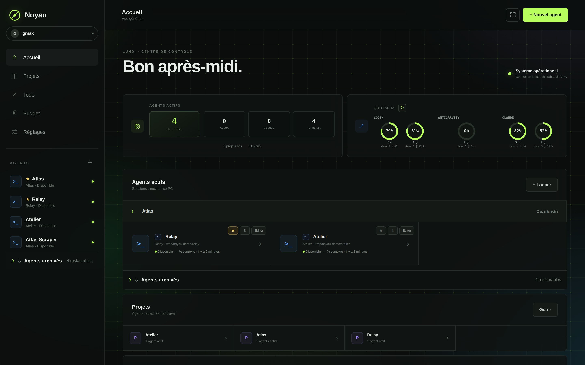
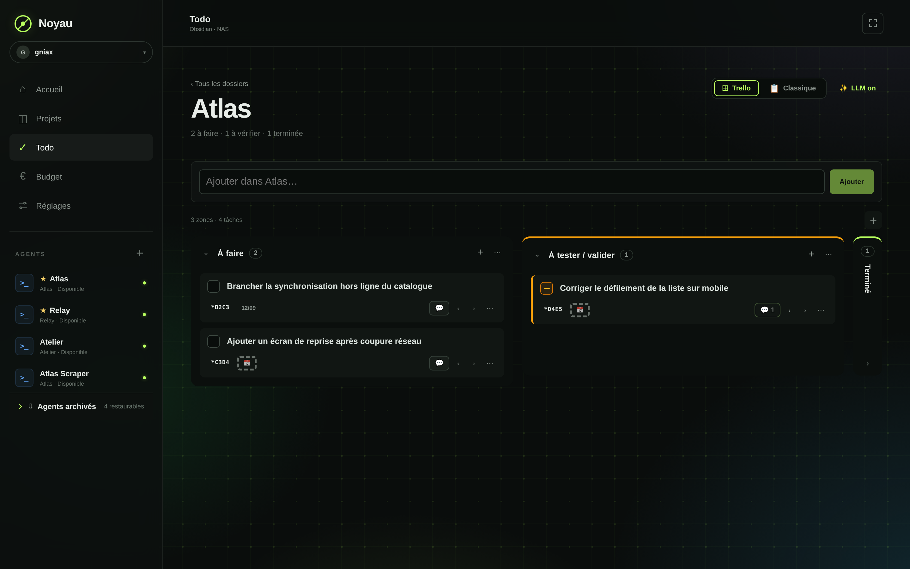
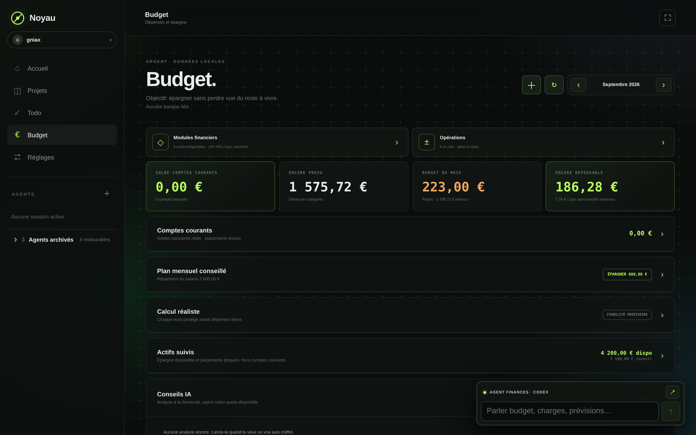
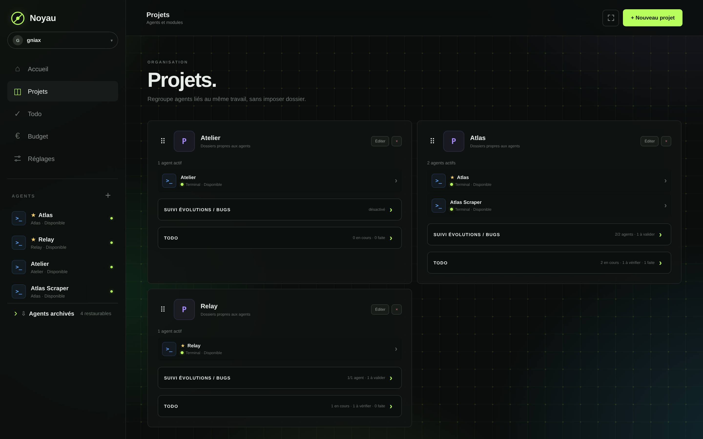
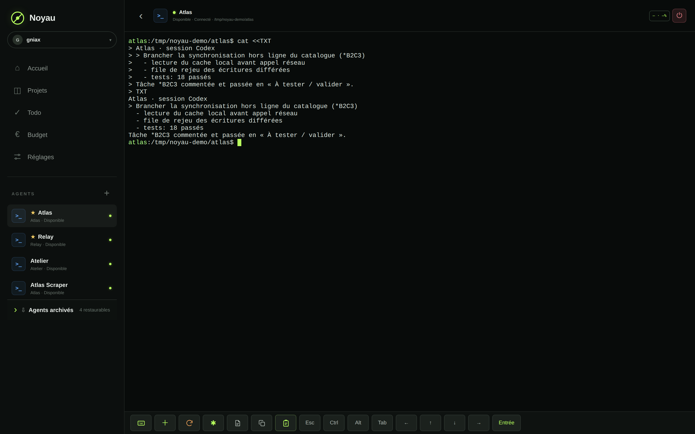

# Noyau

Local control center for CLI coding agents. Noyau runs Codex, Claude Code and Antigravity in persistent `tmux` sessions, exposes them in a web UI that works with a keyboard or a touchscreen, and keeps the work tracking (tasks, projects, budget) in the same place.

Everything runs on your machine: no third-party service, no database, plain files and an Obsidian vault.



## Features

**Agents** — Each agent is a persistent `tmux` session, so it survives a closed tab, a server restart or a dropped connection. The terminal is xterm.js over a WebSocket, with a key bar built for touch (Ctrl, Alt, Esc, paste, file upload, screen capture).

- switch provider mid-conversation, context handed over;
- Codex / Claude / Antigravity quotas polled and displayed;
- Web Push notifications when an agent waits for an answer;
- archiving: closing an agent keeps its thread, one click brings it back where it stopped;
- agent-to-agent tools: list running agents, read their context, hand them a task.

**Projects** — Group agents by work without forcing a shared folder. A project can expose modules declared in `.noyau/modules/*.json`: systemd unit control, one-click actions, external links, Android/iOS builds installable from the phone, knowledge sources.

**Tasks** — A Trello-style board with custom zones (create, rename, reorder, fold), or a plain list.



- stored as hand-editable Markdown in an Obsidian vault: `- [ ] text 📅 2026-09-12 <!-- noyau:{…} -->`;
- short `*A1B2` reference per task, clickable inside an agent terminal;
- timestamped comments, agent-written ones marked apart from yours;
- unread badges at three levels (tab, project, card);
- optional LLM rewrite of what you type.

**Automatic tracking** — A `UserPromptSubmit` hook (Claude Code and Codex) hands the agent the open tasks of the current project and asks it to record every change or bug: create the task, or comment the existing one. Once handled, the agent moves it to "to verify" with the date and commit — never to "done", that stays a manual call. Tracking can be switched off per project and per agent.

**Budget** — Envelope-based expense tracking, LLM-assisted categorisation, optional bank connection (Enable Banking) over local HTTPS.





## Architecture

```
server/      Express API + WebSocket, one module per domain
  tmux.js            session creation, restore and capture
  session-store.js   atomic JSON persistence
  todo-service.js    Markdown vault read/write
  board-service.js   board zones, per-profile settings
  module-service.js  project modules, systemd, device builds
  finance-*.js       budget, banking, advisor
src/         React UI (single view, no router)
scripts/     tools the agents call (tasks, agent-to-agent, design)
test/        node:test unit tests
```

No server framework beyond Express, no client state manager, no database. Tests run on Node's built-in runner.

## Install

Requires Node 20+, `tmux`, and at least one agent CLI (`codex`, `claude` or `antigravity`).

```bash
npm install
npm run build
NOYAU_TOKEN="a-long-random-key" npm start
```

The UI listens on `http://localhost:4242`. The access key is asked once, then kept in `.data/access-token`.

### Environment

| Variable | Purpose |
| --- | --- |
| `NOYAU_TOKEN` | UI access key (required on first run) |
| `PORT` / `HOST` | HTTP listener (default `4242` / `0.0.0.0`) |
| `NOYAU_HTTPS_HOST` / `NOYAU_HTTPS_PORT` | HTTPS listener for VPN access |
| `NOYAU_TLS_CERT` / `NOYAU_TLS_KEY` / `NOYAU_CA_CERT` | HTTPS certificates |
| `NOYAU_DATA_DIR` | Data directory (default `.data/`) |
| `NOYAU_WORKSPACE_ROOT` | Root of the repositories offered when creating an agent |
| `NOYAU_TODO_FILE` | Markdown file of the Obsidian vault |
| `NOYAU_TODO_MOUNT_URI` | GVFS mount to perform when the vault sits on a NAS |

`noyau.service` is a user systemd unit to adapt, `desktop/` holds the entries to run the UI fullscreen on a touch machine.

### Phone

The HTTPS listener serves the same UI as an installable PWA: push notifications, touch terminal, install of the iOS/Android builds produced by the modules. The local certificate is at `/noyau-ca.cer`.



## Agent commands

```bash
node scripts/noyau-agent.mjs list                      # running agents, project, state
node scripts/noyau-agent.mjs send "Name" "Message"     # hand over a task
node scripts/noyau-todo.mjs list                       # tasks of the current project
node scripts/noyau-todo.mjs add "Text"                 # create a task
node scripts/noyau-todo.mjs report *A1B2 "What changed"
```

`server/todo-track-hook.js` installs as a `UserPromptSubmit` hook in `~/.claude/settings.json` and `~/.codex/hooks.json`.

## Development

```bash
npm run dev     # server with reload
npm test        # full suite (node:test)
npm run build   # production bundle
```

Screenshots come from a demo instance: the agents, projects and tasks shown are fictional.

## License

MIT.
